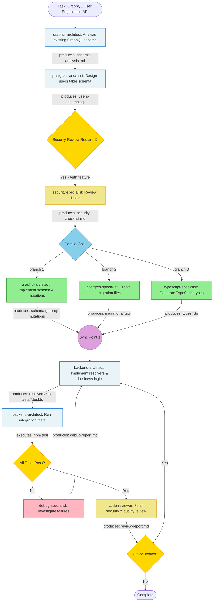

## Task Analysis: GraphQL APIサーバーへのユーザー登録API追加

### Complexity Assessment
**Medium** - GraphQL API拡張、認証・セキュリティ要素、データベーススキーマ設計を含むフルスタック機能追加。複数ドメイン（Backend, Database, Security）にまたがるが、既存のGraphQLインフラを活用できるため、新規構築ほど複雑ではない。

### Recommended Agents
- **graphql-architect** (Model: sonnet): GraphQL schema設計、mutation定義、型システム統合。既存GraphQL APIへの拡張パターンを適用
- **security-specialist** (Model: sonnet): ユーザー登録は認証・個人情報を扱うためセキュリティレビュー必須。入力バリデーション、パスワードハッシュ、レート制限、データ保護の検証
- **postgres-specialist** (Model: sonnet): usersテーブル設計、マイグレーション作成、インデックス最適化、制約定義
- **backend-architect** (Model: sonnet): GraphQL resolver実装、ビジネスロジック、エラーハンドリング、テスト作成
- **typescript-specialist** (Model: sonnet): TypeScript型定義の生成・統合、GraphQL Code Generatorセットアップ
- **code-reviewer** (Model: sonnet): 最終品質チェック、セキュリティ脆弱性スキャン、ベストプラクティス準拠確認
- **debug-specialist** (Model: sonnet) *(条件付き)*: テスト失敗時のみ起動

### Agent Execution Flow

**Mermaid Diagram**: [View flow diagram](./task-flow-graphql-api-server-user-registration-api.mmd)

Click to view inline diagram

### Agent Interaction Matrix

| Agent | Phase | Input Dependencies | Tools Used | Output Artifacts | Can Parallelize With |
|-------|-------|-------------------|------------|------------------|---------------------|
| **graphql-architect** | 1 | Task description, existing GraphQL schema | Read, Grep, Glob | `schema-analysis.md`, requirements | None (Sequential) |
| **postgres-specialist** | 1 | `schema-analysis.md` | Read, Write | `users-schema.sql`, design doc | None (Sequential) |
| **security-specialist** | 2 | `schema-analysis.md`, `users-schema.sql` | Read, Grep, Write | `security-checklist.md`, validation rules | None (Sequential) |
| **graphql-architect** | 3 | `security-checklist.md` | Write, Edit, Read | `schema.graphql`, `mutations.graphql` | postgres-specialist, typescript-specialist |
| **postgres-specialist** | 3 | `users-schema.sql`, `security-checklist.md` | Write, Edit, Bash (psql) | `migrations/001_create_users.sql` | graphql-architect, typescript-specialist |
| **typescript-specialist** | 3 | `schema.graphql` (from graphql-architect) | Write, Edit, Bash (graphql-codegen) | `types/generated.ts`, `types/user.ts` | graphql-architect, postgres-specialist |
| **backend-architect** | 4 | All Phase 3 outputs | Write, Edit, Bash, Task | `resolvers/user.ts`, `tests/user.test.ts`, business logic | None (Sequential - needs all inputs) |
| **backend-architect** | 4 | Resolver implementation | Bash (npm test) | Test results, coverage report | None (Sequential) |
| **debug-specialist** | 5 | Test failures, error logs | Read, Grep, Bash, Task | `debug-report.md`, fix suggestions | None (Conditional) |
| **code-reviewer** | 6 | All implementation files | Read, Grep, Glob | `review-report.md`, quality metrics | None (Sequential) |

### Detailed Task Breakdown

#### Phase 1: Analysis & Schema Design (Sequential - 14-27 minutes)

**Step 1.1** - Agent: `graphql-architect`
- **Input**: Task description, existing GraphQL API codebase
- **Actions**:
  - Glob existing GraphQL schema files (`*.graphql`, `schema/*.gql`)
  - Grep for existing user-related types and mutations
  - Analyze authentication patterns in current API
  - Document required fields for user registration (email, password, username, etc.)
  - Design GraphQL mutation signature: `registerUser(input: RegisterUserInput!): RegisterUserPayload!`
- **Tools**: Read, Grep, Glob, Write
- **Output**: `schema-analysis.md` (mutation design, input/output types, validation requirements)
- **Can Parallel With**: None (blocks subsequent work)
- **Estimated Time**: 8-12 minutes

**Step 1.2** - Agent: `postgres-specialist`
- **Input**: `schema-analysis.md`
- **Actions**:
  - Design `users` table schema with fields: id, email, username, password_hash, created_at, updated_at
  - Define constraints: UNIQUE(email), UNIQUE(username), NOT NULL validations
  - Plan indexes: btree on email, btree on username for fast lookups
  - Consider soft-delete pattern (deleted_at column)
  - Document migration strategy
- **Tools**: Read, Write
- **Output**: `users-schema.sql` (table definition, indexes, constraints)
- **Can Parallel With**: None (depends on Step 1.1)
- **Estimated Time**: 6-15 minutes

#### Phase 2: Security Validation (Sequential - 5-10 minutes)

**Step 2.1** - Agent: `security-specialist`
- **Input**: `schema-analysis.md`, `users-schema.sql`
- **Actions**:
  - Review password handling strategy (bcrypt/argon2 recommendations)
  - Validate input sanitization requirements (email format, username characters)
  - Check rate limiting needs for registration endpoint
  - Verify email uniqueness enforcement at DB and application level
  - Document security requirements: HTTPS only, CSRF protection, email verification flow
  - Review GDPR/data privacy considerations
- **Tools**: Read, Grep, Write
- **Output**: `security-checklist.md` (validation rules, security requirements, recommendations)
- **Can Parallel With**: None (must validate before implementation)
- **Estimated Time**: 5-10 minutes

**Synchronization Point 1**: Security review approved, ready for parallel implementation

#### Phase 3: Parallel Implementation (Parallel - 10-18 minutes)

**Step 3.1** - Agent: `graphql-architect`
- **Input**: `security-checklist.md`
- **Actions**:
  - Create/update GraphQL schema files
  - Define `RegisterUserInput` type with email, username, password fields
  - Define `RegisterUserPayload` type with user object and success/error fields
  - Add `registerUser` mutation to schema
  - Document mutation in schema comments
- **Tools**: Write, Edit, Read
- **Output**: `schema/user.graphql` or updated `schema.graphql`
- **Can Parallel With**: Step 3.2, Step 3.3
- **Estimated Time**: 8-15 minutes

**Step 3.2** - Agent: `postgres-specialist`
- **Input**: `users-schema.sql`, `security-checklist.md`
- **Actions**:
  - Create migration file with timestamp: `migrations/20260108_create_users_table.sql`
  - Implement CREATE TABLE with all constraints
  - Add indexes for email and username
  - Create down migration for rollback
  - Test migration syntax locally
- **Tools**: Write, Edit, Bash (psql for syntax validation)
- **Output**: `migrations/20260108_create_users_table.sql`, `migrations/20260108_create_users_table.down.sql`
- **Can Parallel With**: Step 3.1, Step 3.3
- **Estimated Time**: 6-12 minutes

**Step 3.3** - Agent: `typescript-specialist`
- **Input**: `schema.graphql` (waits for Step 3.1 to produce schema file)
- **Actions**:
  - Configure GraphQL Code Generator if not present
  - Run codegen to generate TypeScript types from GraphQL schema
  - Create custom type definitions for resolver context
  - Add type exports for RegisterUserInput, RegisterUserPayload
  - Ensure strict TypeScript types for resolvers
- **Tools**: Write, Edit, Bash (npm run graphql-codegen)
- **Output**: `types/generated.ts`, `types/resolvers.ts`
- **Can Parallel With**: Step 3.2 (but depends on Step 3.1 completing first)
- **Estimated Time**: 5-10 minutes

**Synchronization Point 2**: All schema, migration, and type files ready. Backend implementation can begin.

#### Phase 4: Integration & Testing (Sequential - 13-28 minutes)

**Step 4.1** - Agent: `backend-architect`
- **Input**: `schema.graphql`, `types/generated.ts`, `migrations/*.sql`, `security-checklist.md`
- **Actions**:
  - Implement `registerUser` resolver in `resolvers/user.ts`
  - Add input validation (email format, password strength, username format)
  - Implement password hashing with bcrypt (salt rounds: 12)
  - Check email/username uniqueness before insertion
  - Execute INSERT query to users table
  - Handle database errors (duplicate key violations → user-friendly error messages)
  - Return RegisterUserPayload with created user (omit password_hash)
  - Write unit tests for validation logic
  - Write integration tests for full registration flow
  - Add error handling test cases (duplicate email, weak password, invalid email)
- **Tools**: Write, Edit, Read, Task
- **Output**: `resolvers/user.ts`, `tests/user.test.ts`, `tests/integration/register.test.ts`
- **Can Parallel With**: None (needs all Phase 3 outputs)
- **Estimated Time**: 10-20 minutes

**Step 4.2** - Agent: `backend-architect`
- **Input**: Resolver implementation, test files
- **Actions**:
  - Run migration in test database: `npm run migrate:test`
  - Execute test suite: `npm test -- user`
  - Verify all tests pass
  - Check code coverage (target: >80% for new code)
  - Run GraphQL query manually to test end-to-end
- **Tools**: Bash (npm commands)
- **Output**: Test results, coverage report
- **Can Parallel With**: None (sequential after Step 4.1)
- **Estimated Time**: 3-8 minutes

#### Phase 5: Debugging (Conditional - 5-15 minutes if triggered)

**Step 5.1** - Agent: `debug-specialist` *(Only if tests fail)*
- **Input**: Test failure logs, error stack traces
- **Actions**:
  - Analyze test failure root cause
  - Identify database connection issues, migration problems, or logic bugs
  - Provide fix recommendations with code examples
  - Suggest additional test cases if gaps found
- **Tools**: Read, Grep, Bash, Task
- **Output**: `debug-report.md`, fix suggestions
- **Can Parallel With**: None
- **Estimated Time**: 5-15 minutes
- **Loop Condition**: Returns to Step 4.1 for fixes, then re-runs Step 4.2

#### Phase 6: Final Review (Sequential - 4-6 minutes)

**Step 6.1** - Agent: `code-reviewer`
- **Input**: All implementation files (resolvers, schema, migrations, tests)
- **Actions**:
  - Run static analysis tools (ESLint, Prettier)
  - Check for security vulnerabilities (SQL injection, XSS, password leaks in logs)
  - Verify adherence to GraphQL best practices
  - Validate error messages don't leak sensitive info
  - Check test coverage meets threshold
  - Review code quality metrics
- **Tools**: Read, Grep, Glob
- **Output**: `review-report.md`, quality metrics, approval/rejection
- **Can Parallel With**: None (final validation phase)
- **Estimated Time**: 4-6 minutes

### Decision Points & Conditional Flows

1. **After Phase 1 (Always triggers)**
   - **Decision**: Security review required?
   - **If YES**: Always invoke security-specialist for user registration (auth-related feature)
   - **If NO**: N/A - always YES for this task
   - **Rationale**: User registration handles sensitive data (passwords, emails) and is a critical security boundary

2. **After Phase 4.2 (Conditional)**
   - **Decision**: Do all tests pass?
   - **If NO**: Invoke debug-specialist → Analyze failures → Return to Step 4.1 with fixes → Re-run tests (loop)
   - **If YES**: Proceed to code-reviewer
   - **Rationale**: Cannot deploy broken functionality; debugging before review saves time

3. **After Phase 6 (Conditional)**
   - **Decision**: Any critical security or quality issues found?
   - **If YES**: Return to Step 4.1 to address issues → Re-run tests → Re-review (loop)
   - **If NO**: Task complete
   - **Rationale**: Final gate to ensure production-ready code

### Tools Required

| Tool | Usage Phase | Purpose | Estimated Frequency |
|------|-------------|---------|---------------------|
| **Read** | All | Read existing GraphQL schema, resolvers, DB setup | High (20-30 files) |
| **Write** | 1, 2, 3, 4 | Create new schema, migrations, resolvers, tests, documentation | Medium (8-12 files) |
| **Edit** | 3, 4 | Modify existing schema files, resolver index, test configs | Low (2-4 files) |
| **Grep** | 1, 2, 6 | Search for existing user patterns, auth patterns, security issues | Medium (5-10 searches) |
| **Glob** | 1, 6 | Find GraphQL schema files, resolver files, test files | Low (3-5 patterns) |
| **Bash** | 3, 4 | Run GraphQL codegen, database migrations, test suite | Medium (6-10 commands) |
| **Task** | 4 | Potential sub-agent orchestration for complex resolver logic | Low (0-1 times) |

### Expected Output Files

| Agent | File Path | Type | Purpose |
|-------|-----------|------|---------|
| **graphql-architect** | `docs/schema-analysis.md` | Report | GraphQL schema design analysis and mutation specifications |
| **graphql-architect** | `schema/user.graphql` | Code | User registration GraphQL schema, mutations, and types |
| **postgres-specialist** | `docs/users-schema.sql` | Report | Database schema design document with constraints and indexes |
| **postgres-specialist** | `migrations/20260108_create_users_table.sql` | Code | Users table creation migration (up) |
| **postgres-specialist** | `migrations/20260108_create_users_table.down.sql` | Code | Users table rollback migration (down) |
| **security-specialist** | `docs/security-checklist.md` | Report | Security validation requirements and recommendations |
| **typescript-specialist** | `types/generated.ts` | Generated | Auto-generated TypeScript types from GraphQL schema |
| **typescript-specialist** | `types/resolvers.ts` | Generated | Resolver type definitions and context types |
| **backend-architect** | `resolvers/user.ts` | Code | User registration resolver implementation with validation |
| **backend-architect** | `tests/user.test.ts` | Test | Unit tests for user registration logic |
| **backend-architect** | `tests/integration/register.test.ts` | Test | Integration tests for full registration flow |
| **code-reviewer** | `docs/review-report.md` | Report | Final code quality, security, and best practices review |
| **debug-specialist** | `docs/debug-report.md` | Report | Debugging analysis and fix suggestions (conditional - only if tests fail) |

**File Type Summary**:
- **Reports** (5 files): Analysis, design, security, review, and debug documentation
- **Implementation Code** (4 files): GraphQL schema, migrations, resolvers
- **Test Files** (2 files): Unit and integration tests
- **Generated Assets** (2 files): TypeScript types from GraphQL schema

**Total Expected Files**: 13 files (12 always generated + 1 conditional)

### Estimated Timeline

**Without Parallelization** (Sequential execution):
- Phase 1: 14-27 minutes (Step 1.1 + Step 1.2)
- Phase 2: 5-10 minutes (Security validation)
- Phase 3: 19-37 minutes (Step 3.1 + Step 3.2 + Step 3.3 sequential)
- Phase 4: 13-28 minutes (Step 4.1 + Step 4.2)
- Phase 5: 0-15 minutes (Conditional - if tests fail)
- Phase 6: 4-6 minutes (Final review)
- **Total: 55-123 minutes** (without debugging) or **60-138 minutes** (with debugging)

**With Parallelization** (Optimized):
- Phase 1: 14-27 minutes (sequential - Step 1.2 depends on Step 1.1)
- Phase 2: 5-10 minutes (sequential - security gate)
- Phase 3: **13-25 minutes** (max of parallel branches, accounting for typescript-specialist waiting for schema)
- Phase 4: 13-28 minutes (sequential - integration)
- Phase 5: 0-15 minutes (conditional)
- Phase 6: 4-6 minutes (sequential)
- **Total: 49-96 minutes** (without debugging) or **54-111 minutes** (with debugging)

**Optimization Gain**: ~11-22% faster with parallel execution

**Critical Path**:
1. graphql-architect (schema analysis) →
2. postgres-specialist (schema design) →
3. security-specialist (validation) →
4. graphql-architect (schema implementation) →
5. typescript-specialist (type generation - waits for schema) →
6. backend-architect (resolver + tests) →
7. code-reviewer

**Blocking Dependencies**: 2 synchronization points
- After Phase 2: Security validation must complete before any implementation
- After Phase 3: All parallel implementations must complete before integration

### Parallelization Summary

**Parallel Opportunities**:
- ✅ Phase 3: graphql-architect + postgres-specialist can run fully in parallel (different files)
- ✅ Phase 3: postgres-specialist + typescript-specialist can run in parallel (different files)
- ⚠️ Phase 3: typescript-specialist partially depends on graphql-architect (waits for schema.graphql to exist, then runs codegen)

**Sequential Requirements**:
- ⛔ Phase 1: postgres-specialist must wait for graphql-architect's schema analysis
- ⛔ Phase 2: security-specialist must validate before implementation begins (security gate)
- ⛔ Phase 4: backend-architect cannot start until all Phase 3 agents complete (needs schema, types, and migration files)
- ⛔ Phase 5: debug-specialist runs only if tests fail (conditional)
- ⛔ Phase 6: code-reviewer must run after all implementation and testing complete

**Conditional Branches**:
- 🔀 After Phase 4 tests: Loop back to Phase 4.1 if failures detected (with debug-specialist assistance)
- 🔀 After Phase 6 review: Loop back to Phase 4.1 if critical issues found

---

### 🎯 Execution Recommendation

**Optimal Execution Strategy**:
1. Run Phases 1-2 sequentially (unavoidable dependencies)
2. **Launch Phase 3 agents in parallel** with this pattern:
   - Start graphql-architect + postgres-specialist immediately in parallel
   - Monitor graphql-architect for `schema.graphql` creation
   - Launch typescript-specialist as soon as schema file exists (don't wait for graphql-architect to fully complete)
3. Synchronize at end of Phase 3, then run Phase 4 sequentially
4. Run Phase 6 review, loop back if needed

**Expected Total Time**: 49-96 minutes (optimistic path) to 54-111 minutes (with debugging iteration)
