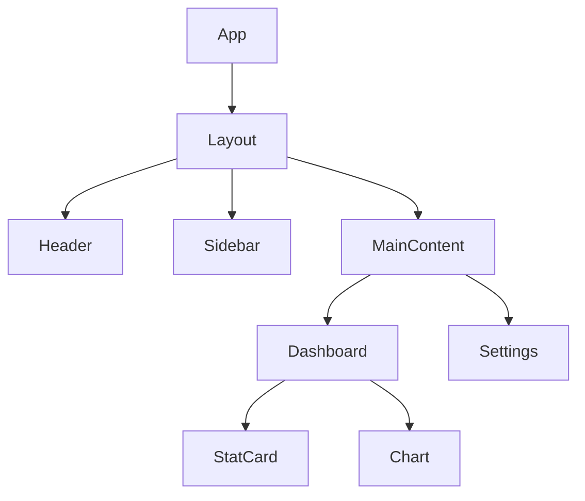
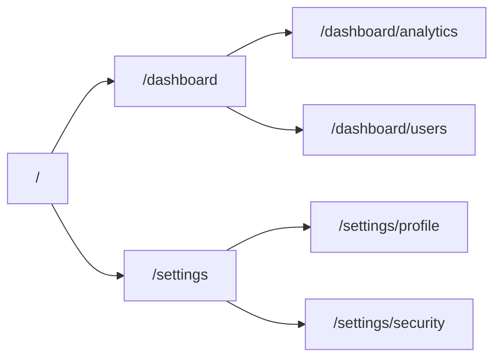

## Purpose

Provide comprehensive analysis of React projects to help developers understand the frontend codebase quickly. This skill leverages the react-specialist agent to analyze React-specific patterns, Next.js conventions, and modern frontend best practices.

## When to Use

Use this skill when you need to:

- **Onboard to a React project** - Get a complete overview of the frontend architecture
- **Understand component structure** - Map component hierarchy and relationships
- **Count screens/pages** - Identify all routes and page components
- **Analyze UI patterns** - Discover design patterns and component abstractions
- **Review custom hooks** - Understand shared logic and state patterns
- **Examine state management** - Identify Context, Zustand, Redux, or other solutions
- **Map routing** - Understand navigation structure and route organization
- **Document the frontend** - Generate onboarding documentation

## Key Information

### Project Structure Patterns

#### Next.js App Router (v13+)

```
project/
├── app/
│   ├── layout.tsx           # Root layout
│   ├── page.tsx             # Home page (/)
│   ├── globals.css
│   ├── (auth)/              # Route group
│   │   ├── login/
│   │   │   └── page.tsx     # /login
│   │   └── register/
│   │       └── page.tsx     # /register
│   ├── dashboard/
│   │   ├── layout.tsx       # Nested layout
│   │   ├── page.tsx         # /dashboard
│   │   └── [id]/
│   │       └── page.tsx     # /dashboard/:id
│   └── api/
│       └── route.ts         # API routes
├── components/
│   ├── ui/                  # Base UI components
│   ├── features/            # Feature-specific components
│   └── layouts/             # Layout components
├── hooks/                   # Custom hooks
├── lib/                     # Utilities and helpers
├── stores/                  # State management
└── types/                   # TypeScript types
```

#### Next.js Pages Router

```
project/
├── pages/
│   ├── _app.tsx             # App wrapper
│   ├── _document.tsx        # Document customization
│   ├── index.tsx            # Home page (/)
│   ├── api/                 # API routes
│   └── [slug].tsx           # Dynamic routes
├── components/
├── hooks/
└── styles/
```

#### Vite + React SPA

```
project/
├── src/
│   ├── main.tsx             # Entry point
│   ├── App.tsx              # Root component
│   ├── pages/               # Page components
│   ├── components/
│   ├── hooks/
│   ├── stores/
│   └── routes/              # Route configuration
└── index.html
```

### Analysis Checklist

When analyzing a React project:

1. **Identify Framework & Structure**
   ```bash
   # Check for Next.js
   grep -l "next" package.json && ls -la app/ pages/ 2>/dev/null

   # Check for Vite
   grep -l "vite" package.json && ls -la src/

   # Check package.json for clues
   cat package.json | grep -E '"(next|vite|react-scripts|gatsby)"'
   ```

2. **Count Pages/Screens**
   ```bash
   # Next.js App Router pages
   find app -name "page.tsx" -o -name "page.jsx" | wc -l

   # Next.js Pages Router
   find pages -name "*.tsx" -o -name "*.jsx" | grep -v "_" | wc -l

   # SPA routes (look for route definitions)
   grep -r "path:" --include="*.tsx" src/routes/
   ```

3. **Map Components**
   ```bash
   # Find all components
   find . -path ./node_modules -prune -o -name "*.tsx" -print | grep -E "(components|ui)/"

   # Count components by directory
   find components -name "*.tsx" | wc -l

   # Find component exports
   grep -r "export.*function\|export default" --include="*.tsx" components/
   ```

4. **Analyze Custom Hooks**
   ```bash
   # Find custom hooks
   find . -path ./node_modules -prune -o -name "use*.ts" -print
   find . -path ./node_modules -prune -o -name "use*.tsx" -print

   # List hooks directory
   ls -la hooks/ src/hooks/ 2>/dev/null
   ```

5. **Identify State Management**
   ```bash
   # Check for state libraries in package.json
   grep -E "(zustand|redux|recoil|jotai|mobx)" package.json

   # Find Context providers
   grep -r "createContext\|useContext" --include="*.tsx"

   # Find Zustand stores
   grep -r "create\(" --include="*.ts" stores/
   ```

6. **Review UI Library**
   ```bash
   # Check for UI libraries
   grep -E "(@radix-ui|@headlessui|@mui|antd|chakra)" package.json

   # Check for Tailwind
   ls tailwind.config.* 2>/dev/null

   # Check for shadcn/ui
   ls components/ui/ 2>/dev/null
   ```

### Component Patterns

#### Atomic Design

```
components/
├── atoms/           # Button, Input, Label
├── molecules/       # FormField, SearchBar
├── organisms/       # Header, Sidebar, Form
├── templates/       # PageLayout, DashboardLayout
└── pages/           # Assembled pages
```

#### Feature-Based

```
features/
├── auth/
│   ├── components/
│   ├── hooks/
│   └── api/
├── dashboard/
│   ├── components/
│   ├── hooks/
│   └── api/
└── settings/
```

#### Container/Presentational

```
components/
├── UserList/
│   ├── UserList.tsx         # Presentational
│   ├── UserListContainer.tsx # Container (data fetching)
│   └── index.ts
```

### State Management Patterns

| Pattern | Files to Look For | Use Case |
|---------|------------------|----------|
| React Context | `*Context.tsx`, `*Provider.tsx` | Simple global state |
| Zustand | `stores/*.ts`, `use*Store.ts` | Medium complexity |
| Redux Toolkit | `store/`, `slices/`, `*Slice.ts` | Complex state |
| Jotai/Recoil | `atoms/`, `*Atom.ts` | Atomic state |
| React Query | `queries/`, `use*Query.ts` | Server state |

### Output Format

Generate a React project report with:

1. **Project Overview**
   - Framework (Next.js version, Vite, etc.)
   - React version
   - TypeScript usage
   - Key dependencies

2. **Page/Screen Inventory**
   - Total page count
   - Route structure (tree view)
   - Dynamic routes
   - Protected routes

3. **Component Architecture**
   - Component organization pattern
   - Total component count
   - Shared vs feature components
   - Component hierarchy diagram

4. **Hooks Analysis**
   - Custom hooks list
   - Hook dependencies
   - Shared logic patterns

5. **State Management**
   - Solution used (Context, Zustand, etc.)
   - Store structure
   - Data flow patterns

6. **UI/Styling**
   - CSS solution (Tailwind, CSS Modules, etc.)
   - UI library (shadcn, Radix, etc.)
   - Design system patterns

7. **Key Files to Read**
   - Recommended reading order
   - Entry points
   - Critical components

### Mermaid Diagrams

#### Component Tree Example


#### Route Structure Example

